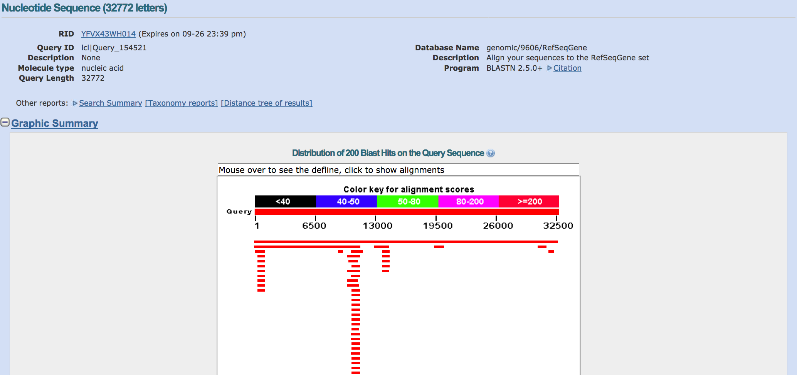

#Introduction to Bioinformatics

#### Week of : September 29, 2016

### Important terms

* Computer
* Data
* Sequence
* NCBI
* Database
* BLAST
* *in vivo*
* *in silico*

### Important Concepts
* Bioinformatics explores biology at the "Information" level
* "All models are wrong, some are useful"*
* Reductionism vs. Holism

### Some Questions
*Think about answering these before you read the notes/watch the video lecture*

* How do you think computers are used to understand biology?
* What is(are) Data?
* What is a model?
* What is a computer language?

\* Actual quote from E.P. Box "Essentially, all models are wrong but some are useful. However, the approximate nature of the model must always be borne in mind."

## Introduction to bioinformatics

According to Wikipedia [Bioinformatics](https://en.wikipedia.org/wiki/Bioinformatics) is "an interdisciplinary field that develops methods and software tools for understanding biological data. As an interdisciplinary field of science, bioinformatics combines computer science, statistics, mathematics, and engineering to analyze and interpret biological data. Bioinformatics has been used for in silico analyses of biological queries using mathematical and statistical techniques."

In our class, bioinformatics will be as essential a tool as a pipette or a microscope. In often in high school, we get to examine a problem or question though one or just a few levels. In science, we often can examine textbooks and journal articles, but we also experiment. We will learn in this lecture how bioinformatics allows us to experiment in new ways, and also derive knowledge through a different type of experiment, the *in silico* experiment.

## Lecture

**Download the lecture:** [Link](https://www.dropbox.com/s/63qdb28kjntwrfn/video_sep_26_2016.zip?dl=0) 

#### Your first *in silico* experiment - DNA extraction (from a database)

In this experiment, we will attempt to decode a DNA sequence. We need to understand what information the sequence contains (is this a gene? what is the name and function of the gene? what are some features of the gene?).

1. Take the following DNA sequence and copy it onto your clipboard (highlight then CONTROL+C (windows) or COMMAND+C (mac)

    CTCCTTGGTTCAAGTAATTCTCCTGCCTCAGACTCCAGAGTAGCTGGGATTACAGGCGCCCGCCACCACG
CCCAGCTAATTTTTTGTATTTTTAATAGAGATGGGGTTTCATCATGTTGGCCAGGCTGGTCTCGAACTCC
TGACCTCAGGTGATCCACCTGCCTCAGCCTCCCAAAGTGCTGGGATTACAGGAGTCAGCCACCGCACCCA
GCCCCAACTAATTTTTGTATTTGAGTAGAGACAGGGTTTTACCATGTTGGCCAGGCTGGTCTAAAACTCT
TCACCTCAGGTGATCCACCCATCTCAGCCTCCCAAAGTGTTGGGATTACAGGCGTGAGCCACCGTGCCTG
GCCCTGGATTTCACTCTTGCCCACCCATAAACCATTCACTCTTCTGTTTTAAAACTCTCTTGGCCGGGCG
CAGTGGCTCATGCCTGTAATCCCAGCACTTTGGGAGGCCAAGGTGGGCAGATCACAAGGTCAGGAGTTCG
AGACCAGCCTGGCCAATATGATGAACCCCCCATCTCTACTAAAAAAATACAAAAAAATTAGCCGGGTGTG
GTGGCACATGCCTGTAATCCCAGCTACTCGGAAGGTTGAGGCAGGAGAATCACTTAAACCTGGGAGGCGG
AGGTTGCGGTGAGCTGAGATGGTGCCACTGCACTCCAGCCTGGACAACAGAGCAAGACTCTGTCTCAAAC
AAACAAACAAAAAAAACCTCTCTCATGGCCTGGCATGGTGGCTCACGCCTGTAATCCTAGCACTTTGGAA
GGCTGAGGCAGGTGGATCACCTGAGGTCAGGAGTTTGAGACCAGCCAGGCCAACGTGGCAAAACCTGTCT
CTACTAAAAATACAAAAATTAAGCCAGGCGCGGTGGCTCATGCCTATAATCCCAGCACTTTGGGAGGCCG
AGACCGGCGGATCAAATGTCAGGAGTACGAGACCATCCTGGCCAATATGGTAAAACCCCGTCTCTATTTA
AAAAAATACAAAAATTAGCTGGGCATGGTGGCGGGTGCCTGTAATCCCAGCTACTCGGGAGGCTGAGGCA
GGAGAATCGCTTGAATCCAGGAGGCAGAGGTTGCAGTGAGCCGAGATCACGCCATTGCACTCCAGCCTGG
GCGACAGAGCAAGACTCGTCTCAAAAAAAAAAAAAAAACACCTCTCTCATGACTTCCCAAATAAACTCCA
AATGCCTTACCCATAAGAACCAACACGACGTGGCTGCTCTTCTCTGTCCTCACCCCTCTGTCCCCCTCAC
TTGCCTCAGTCTGGCTATACCAGCATTCTGGGTTTTTTGTTTTGTGTTTGTTTGTTTGTTTGTTTGTTTG
TTTGTTTGTTTTGGGATGGAGTCTCACTCTGTCACCCAGGCTGGAGTGCAGTGACATGATCTTGGCTCAC
TGCAACCTCCATCTCCTGGGTTCAAATGATTCTTCTGCTTCAGCCTCTCAAGTAGCTGGGATTACAGGCA
CCCACCATCACACCCAGCTAATTTTTGTATTTTTGTAGAGATGAGGTTTTGCCATGTTGGCCAGGCTGGT
CTCAAACTCTTGACCTCAGGTGATCTGCCCACCTCAGCCTCCCAAAGTGCTGGGATTACAGGTGTGAGCC
ACTGAGCCCAGTCTGTTTTGTTGTTTTTTGAGATGGAGTCTCACTCTGTCGCCCAGGCTGGAGTGCAGTG
GTACAATTTTGTCTGACTGCAGCCTCCACCTCCTGAGTTTAAGAGATTCTCCTGCCTCAGCCACACAAGT
AGCTGGGATTACAGGCGCGTGCCACCACATGCGTCTAATTTTGGTATTTTTAGTAGCGATGGGGTTTTGC
CATATTGGCCAGGCTGGTCTCGAACTCCTGGCCTCAAGTGATCTGCACACCTCGGCCTCCTGAGTAGCTG
GGATTACAGGCGTGAGCCACCATGCAGGGCCTTTCTGGTCTTTTAACGCACAAAGCTATTTCCCAGTTCT
GGGTGTTTATAGTATCATTGCCAGTTCCTGGAAAGCTCTTTCCAGAAGCCTTCACATGACTGATCCCTTA
TCCTCCTTCAGGTCTTAGCTCAAATGCCTCCTTTTCAGAGAGCTCCTTCCTGACCATTTTATGCAATGTG
CTTTCCTCTAGTTAGTCTCTCTTCATTCTGTGTATTTCCTTCAGAGCATTTATCATCATCTTGGTCCTGA
TGCTTGCTGGTTTACATGTTTGTTGTCTGTCTCCCACACAGAAAGCAAACCAGCCCTTCATCTGTCTTGT
CCACCACTTTATCCCAGCACAGTGACTAACATATATCAGTAGTCAATCAATAAATAGCTATAAGCCAGGC
ACGGTGACTCACACCTGTGATCCCCGCACTTTGGGAGGCCAAGGTGGGCGGATCCTCTGAGGTCAGGAAT
TTGATATCAGCCTGCCCAACATGGCGAAACCCCGTCTCTACTAAAACTATAAAAATTAGTCGAGTGTGAT
GGCGTGCGCCTGTAATACCAGCTACTTGTGAGGCTGAGGCAGGAGAATCGCTTGAACCCGGGAGGCAGAG
GTTGCAGTGAGCCGAGATCACACCACAGCACTCCAGCCTGGGTGACAGAGCAAGACCTTGTCTCAAAAAA
ATAAGAAATAGAAATATATATATGCTGCCACAAGAAATTCACTACTTTTTAGCAAAAAACACAGATTCCT
AATTAAAGAAAGGGGAAACCTCTCTCTAAATAACTTCAGAATTCGGGGCAGAAAACGCTACATGTGGAAA
CTCGTCTTGAAAAACAGTCCCGTTTGTGAACAGGAAACACTTGGACTACACTTTTTCCATCTCCACGAAG
GACTTAAATGTGCAGCATTGATGAAGAGGCAGTTAGCCCCAGTCCTTACCATTTCTGCATATTCCACCTG
CTCCCCCTCATGGTACAGCTCTGGGGGCAGGTTATAAATTCGCAAGATGTTATCAGCACTATTGGTCAAG
ATGCAGGAACCGTCAGGAGCCCTAGAAACAGGGGAGAGTTAGAAAGCTGGCCAGACCTATGCTTTTCAAG
TGTAGGGCTAGGGCTGAGCCTGCCTCTGGGGTAGGTAAGCCCCCCTGAATCCTTGAGGGAAGTAGAAGAC
ACAAACTGCTAGATAAAATGTAAGCTCAGTCTAAAAGGGCTACGTGCCGCTTCTCCCAGCTCTGGGGCAT
CCCTCTCCTAGAAAACTGGACTGTTTTACAGTGAAAATCTCGGGGGTGGTCAGCTCCCTGCCCCGTTGTT
ATCCTTACCACTTACAGCCTTTCAAGAAGTTCTCAGGTTGGGTGCTGAACTCTGACCAGGAACCACTGAG
AAATCGAGGCAGCTGGGAGAAGCTGTAGTTCCAAGCGCTGAAAGGAAGATGGGGGACAATAAACCTGGGT
CGCCAAGCAAAGGGGGCAGAGGCCTGGAGAAGTGGGTCTCAGGACCAGAGGACAGATCGACCTCACACTT
CATCTCCCCAGACTCCACACTCCACTGCCATCACCACTTACGTGTCTCCCTCGTCCTCTGCAGCGGGTTC
CCCAGAGGTATCTTCCATGGCTTTTCCAGACCCCAACTCTGGCCCGTTCGCTTCTTCTTCAGAAAGGCTC
CCGTTTGCTTCTTCTGCAGGAAGGCTTGTATTTTCAGAAAGTTCTTGCTCCTCGATTCGAGGACTCAACT
CACTAGGGGAACCAAACTCTGTTTCCAGGGGAGTGGAGAGAGAAACTGGGTCCCCCTCCCGTAGCTCCTG
GGACACAGCTGAGCCAGCCACAGGATCTGGGGACAACCGGGGCGGATCCCCCCTTTCGGGAGGCGGTGGC
ATCAGTTCAGAGTCCGCATTTTTATTCATCGGGGAAGCGTGGGGAGAAGGATGGGCTGGAGCTGGGTCCT
GGTCTGAAGGACAGCAGTCCGGAGCTAACGGTTGAGTCTCCAAAGTCTTCATACTGCAGAGGAAGCACAG
CGGAGATTAGCCTCAGCCAGGATGGCTTCGAAGTTCTCAGGGATCCGACGCAGAGCTAAAGAAACCCACC
TGTGCTTCCCTCCTCTTCTGGGAGTAGGCAGAAGACTCCCGGGAGGAGAGGCGAACAGCGGACGCCAATT
CTTTTGAAAGCACTGTGTTCCTTAGCACCGCGGGTCGCTACGGGCCTCTTGCTGTCGCGGGATTTCGGTC
CACCTTCCGATTGGGCCGCCGCATCCCGGATCAGATTTCGCGGGCGACCCACGGAACCCGCGGAGCCGGG
ACGTGAAAGGTTAGAAGGTTTCCCGTTCCCATCAAGCCCTAGGGCTCCTCGTGGCTGCTGGGAGTTGTAG
TCTGAACGCTTCTATCTTGGCGAGAAGCGCCTACGCTCCCCCTACCGAGTCCCGCGGTAATTCTTAAAGC
ACCTGCACCGCCCCCCCGCCGCCTGCAGAGGGCGCAGCAGGTCTTGCACCTCTTCTGCATCTCATTCTCC
AGGCTTCAGACCTGTCTCCCTCATTCAAAAAATATTTATTATCGAGCTCTTACTTGCTACCCAGCACTGA
TATAGGCACTCAGGAATACAACAATGAATAAGATAGTAGAAAAATTCTATATCCTCATAAGGCTTACGTT
TCCATGTACTGAAAGCAATGAACAAATAAATCTTATCAGAGTGATAAGGGTTGTGAAGGAGATTAAATAA
GATGGTGTGATATAAAGTATCTGGGAGAAAACGTTAGGGTGTGATATTACGGAAAGCCTTCCTAAAAAAT
GACATTTTAACTGATGAGAAGAAAGGATCCAGCTGAGAGCAAACGCAAAAGCTTTCTTCCTTCCACCCTT
CATATTTGACACAATGCAGGATTCCTCCAAAATGATTTCCACCAATTCTGCCCTCACAGCTCTGGCTTGC
AGAATTTTCCACCCCAAAATGTTAGTATCTACGGCACCAGGTCGGCGAGAATCCTGACTCTGCACCCTCC
TCCCCAACTCCATTTCCTTTGCTTCCTCCGGCAGGCGGATTACTTGCCCTTACTTGTCATGGCGACTGTC
CAGCTTTGTGCCAGGAGCCTCGCAGGGGTTGATGGGATTGGGGTTTTCCCCTCCCATGTGCTCAAGACTG
GCGCTAAAAGTTTTGAGCTTCTCAAAAGTCTAGAGCCACCGTCCAGGGAGCAGGTAGCTGCTGGGCTCCG
GGGACACTTTGCGTTCGGGCTGGGAGCGTGCTTTCCACGACGGTGACACGCTTCCCTGGATTGGGTAAGC
TCCTGACTGAACTTGATGAGTCCTCTCTGAGTCACGGGCTCTCGGCTCCGTGTATTTTCAGCTCGGGAAA
ATCGCTGGGGCTGGGGGTGGGGCAGTGGGGACTTAGCGAGTTTGGGGGTGAGTGGGATGGAAGCTTGGCT
AGAGGGATCATCATAGGAGTTGCATTGTTGGGAGACCTGGGTGTAGATGATGGGGATGTTAGGACCATCC
GAACTCAAAGTTGAACGCCTAGGCAGAGGAGTGGAGCTTTGGGGAACCTTGAGCCGGCCTAAAGCGTACT
TCTTTGCACATCCACCCGGTGCTGGGCGTAGGGAATCCCTGAAATAAAAGATGCACAAAGCATTGAGGTC
TGAGACTTTTGGATCTCGAAACATTGAGAACTCATAGCTGTATATTTTAGAGCCCATGGCATCCTAGTGA
AAACTGGGGCTCCATTCCGAAATGATCATTTGGGGGTGATCCGGGGAGCCCAAGCTGCTAAGGTCCCACA
ACTTCCGGACCTTTGTCCTTCCTGGAGCGATCTTTCCAGGCAGCCCCCGGCTCCGCTAGATGGAGAAAAT
CCAATTGAAGGCTGTCAGTCGTGGAAGTGAGAAGTGCTAAACCAGGGGTTTGCCCGCCAGGCCGAGGAGG
ACCGTCGCAATCTGAGAGGCCCGGCAGCCCTGTTATTGTTTGGCTCCACATTTACATTTCTGCCTCTTGC
AGCAGCATTTCCGGTTTCTTTTTGCCGGAGCAGCTCACTATTCACCCGATGAGAGGGGAGGAGAGAGAGA
GAAAATGTCCTTTAGGCCGGTTCCTCTTACTTGGCAGAGGGAGGCTGCTATTCTCCGCCTGCATTTCTTT
TTCTGGATTACTTAGTTATGGCCTTTGCAAAGGCAGGGGTATTTGTTTTGATGCAAACCTCAATCCCTCC
CCTTCTTTGAATGGTGTGCCCCACCCCGCGGGTCGCCTGCAACCTAGGCGGACGCTACCATGGCGTGAGA
CAGGGAGGGAAAGAAGTGTGCAGAAGGCAAGCCCGGAGGTATTTTCAAGAATGAGTATATCTCATCTTCC
CGGAGGAAAAAAAAAAAGAATGGGTACGTCTGAGAATCAAATTTTGAAAGAGTGCAATGATGGGTCGTTT
GATAATTTGTCGGAAAAACAATCTACCTGTTATCTAGCTTTGGGCTAGGCCATTCCAGTTCCAGACGCAG
GCTGAACGTCGTGAAGCGGAAGGGGCGGGCCCGCAGGCGTCCGTGTGGTCCTCCGTGCAGCCCTCCGGCC
CGAGCCGGTTCTTCCTGGTAGGAGGCGGAACTCGAATTCATTTCTCCCGCTGCCCCATCTCTTAGCTCGC
GGTTGTTTCATTCCGCAGTTTCTTCCCATGCACCTGCCGCGTACCGGCCACTTTGTGCCGTACTTACGTC
ATCTTTTTCCTAAATCGAGGTGGCATTTACACACAGCGCCAGTGCACACAGCAAGTGCACAGGAAGATGA
GTTTTGGCCCCTAACCGCTCCGTGATGCCTACCAAGTCACAGACCCTTTTCATCGTCCCAGAAACGTTTC
ATCACGTCTCTTCCCAGTCGATTCCCGACCCCACCTTTATTTTGATCTCCATAACCATTTTGCCTGTTGG
AGAACTTCATATAGAATGGAATCAGGCTGGGCGCTGTGGCTCACGCCTGCACTTTGGGAGGCCGAGGCGG
GCGGATTACTTGAGGATAGGAGTTCCAGACCAGCGTGGCCAACGTGGTGAATCCCCGTCTCTACTAAAAA
ATACAAAAATTAGCTGGGCGTGGTGGGTGCCTGTAATCCCAGCTATTCGGGAGGGTGAGGCAGGAGAATC
GCTTGAACCCGGGAGGCAGAGGTTGCAGTGAGCCAAGATCGTGCCACTACACTCCAGCCTGGGCGACAAG
AACGAAACTCCGTCTCAAAAAAAAGGGGGGAATCATACATTATGTGCTCATTTTTGTCGGGCTTCTGTCC
TTCAATGTACTGTCTGACATTCGTTCATGTTGTATATATCAGTATTTTGCTCCTTTTCATTTAGTATAGT
CCATCGATTGTATATCCGTCCTTTTGATGGCCTTTTGAGTTGTTTCCCATTTGCGGTTATGAAATAAAGC
TGCTATAAACATTCTTGTACAATTCTTTTTGTGATCATATGTTTTCGTGTTTCTTGGAGAAATACTTAGG
AGGGGAATTGCGAGTTTGGAAGTAAAAAGTAGCTGTATTTTGAACTTTTTCAGAAGCTCTGAGTTTTCCA
GAGCGGTTGTACCATTTTACACTCCAACTAGCAAGGTATGGGAGTTATTATGGTTGTGCCACAGCCTTCC
GGACATTAGGTATTGTCAGTCTTTCTAATGTGGTATATCCTTGTGGTTGTAATTTACAGTTCTCTATTGA
CTAAGGATGTTCAGCATTTTTTCATGTGCCTATTGGCCATTCGTATTTTGTTTGTAAAGTAGCTCTTCGA
GTCTTTTACCTGTTATTTTGGTTTTTTGTTTGTTTTTATTGTTCAGTTGTGGGACTGCTTTATACATTCT
GGATACAAGTCCTTTATCAGATCCATGTGTCGTGAATGTTTTCTTCTGATCTGTTGCTTGCCTATTTGTT
TGCTTTACAGAGTTTACAGTATCTTAAGAGGAGTGGATTTATCTTTTTTATGTTCAGTATTTGCCTTGTC
CTGTTTAGGACATCTTTTTTTTTTTTTTTAACCCCAGGGTCATGAAGATATTATCTTACATTTTCTTTTA
GGACCTTTATGGTTGTAAGTTTTACAGTAAGGTCCTTGAGCCATTAATTAATTCTTAAAATTAATTGTTT
ATGGTGTGAGGTGTAGGAGTCAGTCTCTGGTATCTTTCCTGTATGGAAATCCAGTTATTCTGTCTCCACT
TGTTGAAATAGGCTTCCTTTCTCTACTGAATGCTTTTAATTTTAATTATTTTACAGTTGGAGTATAGGGC
TACCATTTTAGTGCTATTTTCTTTTTTTCTTTGTTAATTTTTGAGACAGGGACTCACACTGTTGCCCAGG
CTAGAGTACAATGGCACAATCAAGGCTTACTGCAGCCTCGAACCCCTGGGCTCAAGCAGTCCTCTAGCAG
CCTCACGAGTAGCTGGGATTACTCCACCACACCCAGCTAACTATTTTATTTTTTTGTATTGACAGGATCT
CACTATGTTGCCCAGGCTGGTCTCAAACTGCTGGCCTCAAGCTTTCATCCCATCTCGGCCTCCCAAAGTG
CTGGGATTACAGGTGTGAGCCACCATGCCTGACCTCTTAGTGCTATTTTCTATTTATCTCCTCTGTTCTC
TGCTCTCTTTAAACGTTGGAGGAAGAAACAGTACCCATCTTACACAAACTCTTCAGAAAACAGAGGAACA
GACTGGGCGCGGTGGCTCATACCTGTAATCTCAGCACTTTGGTACGCTGAGGCAGGGGATCATTTGAGGT
CGGGAGTTCGAGACCAGCCTGGCCAACACGGCGAAACCCCATCTCTACTAAAAATACAAAAAGTAGCTAG
GCGTGGTGACACATACCTGTAATGCCAGTTACTCAGGAGGCTGAGGCACAAGAATCCCTTGAACCTGGGA
AGCGGAGGTTGCAGTGAGCCGAGATTGCGCCACTGCACTCCAGCCTGGGCAACAGAGTGAGACCCTGTCT
CAGAAAAAAAAAGAAAGAAAGAAAAAATAGAGGAATATTTCCCAACTTGTTTTCGAAGCCAGCATAATCC
TGGTACCAAAACCAAACAAGGACATTATAAGAAAAGAAAATATAGACCAATATTCCTGTTAGCATAGACA
TGCAACAGCTAACCAATTTTAGCAAACCAAACCTGGTAATATAGAAAAAAGGATAAATAGGCCAGTCGCG
GTGGCTCACGCCTGTAATCCCAGCACTTTGGGAGGCTGAGGCAGGCAGATCACTTGAGGTCAGGAGTTTG
AGACCAGCCTGACCAACATGGTGAAACCCCGTTTCTAATAAAAATACAAAAATCAGGCTGGGCACGGTGG
CTCACGCCTGTAATCCCAGCACTTTGGGAGGCCGAGGTGGGCAGATCACGAGGTCAGGAGTTCAAGACCA
GCCTGACCAATGTGGTGAAACGCCATCTCTACTAAAAATACAAAAATCAGCCGGTGTGGTGGCACCTGCC
TGTAATCCCAGCTACTCAGGAGGCTGAGGCAGAATTGCTTGAACCCGGGAGGCAGAGGTTGCAGTGAGCC
AAGATCGTGCCACTGCACTCCAGCCTGGGCGACAGAGCAAGACTTCATCTCAAAAAAAAAAAAAAATTAG
CTGGGCATGGTGGTGGGCACCTGAAATCCCAGCTACTCGGGAGTCTGAGGCAGGAGAATCGCTTGAACCC
AGGAGGCAGAAGTTGCACTGAGCTGGGATCACACCATTGCACTCCAGCCTGGGCAACAGAGTGAGACTCC
ATCTCAAAAAAAGAAAAAGAAAAAGGATAAATACATTCTAACCAAATAATGTTTATCTCATGATTGTAGC
TGATTCAACATTCAAAAATTGGCCTGGTGCAGTAGCTCAGGCCTGTAATCCCAACATTTTAGGAGGCTGA
GGCAGGAAGATCTCTTGAGCCCAGGATTTCAAGACCAGCCTGGGCAACATAGTCAGACTGGTCTTTACTG
GGGGGAAAAAAATCAGTCTGTGTAATTCACCACATTAACAAAGGGAAACATAAAAACCCTATGATCATTT
CAACAGATGTAGCAAAAGCAGTTAATGATATTCAACACATATGCATGATTACAAACCAACCAACCTCCTA
GCAAACTAGGGAAAGGAAACTTAACCTAGTTTGATAACAGGGCGTCCACAGTCGGAGTTCCACTAGCAGC
ATACATAATGGTAGAAAACTCAGTGCTGCCGGGCGCGGTGGCTCACGCCTGTAATGCCAGCACTTTGGGA
GGCCTAGGCGGGCGGATCACGAGGTCAGGAGATCGAGACTGTCCTGACTAGCATGCTGAAACCCCGTCTC
TACTAAAAATACAAAAACAAAAAATTAGCCGGGCATGGTGGCGGGCGCCTATAGTCCCAGCTACTCGGGA
GGCTGAGGCGAGAGAATGGCGTGAACCCGGGAGGCGGAGCTTGCAGAGCCTAGATCGTGCCACTGCACTC
CAGCCTGGGTGACAGAGTGAGACTTCGTCTCAAAAAAAAAAAAAAAAAAAAAAGAAAAGAAAACTCAACG
CTTTTTCCTCTAAGATCAGGAACTAGAAAAGGATTTGACTCTCACAACGTTGATACCATACTGGAGGTTT
TAACCAGGCAAGAAAAAGAAATAATGAGGGCCGGGTGCGGTGGCTCAGGCCTGTAATCCCAGCACTTTGG
GAAGCCGAGACGGGTGGATCACGAGGTCAGGAGATCGAGACCATCCTGGCTAACACGGTGAAACCCTGTC
TCTACTAAATATACAAAAAATTAGCCGGGCGTAGTGGCGGGCGCCTGTAGTCCCAGCTACTCGGGAGGCT
GAGGCAGGAGAATGGCGTGAACTCAGGGGGCGGAGCTTGCAGTGAGCTGAGATCGAGCCACTGCACTCCA
GCCTGGGCGACAGAGCAAGACTGTGTCTCAAAAAAAAAAAAAGAAAAAGAAATAATGATTAGTGGCCCGA
TGTCTCACGCCTATAATCCCAGCACTTTGGGAGGCCGAGGTGGGCAGATCACCTGAGGTCTGGAGTTGGA
GACCAGCCTGACAAAGATGGTGAAACCTCGTCTCTATTAAAATATTAAAAAAATAGCCAGGCGTTGGCCG
GGTACAGTGGCTCATGCCTGTAATCCCAGCACTTTGGGAGGCCGAGGTGGGTGGATCACCTGAGGTCAGG
AGTTCAACACCAGCCTGGCCAACATGGTGAAACCCCATCTCTACTAAAAATACAAAAATTAGCCGGGCGT
AGTGGCGGGCGCCTGTAATCCCAGCTACTTGGGAGGCTTAGGCAGGAGAATCGCTTGAACCTGGGAGGCG
GAGGTTGTAGTGAGCCGAGATTGCACCATTGCACTCCAGCCTGGGTGACAAAAGCAAAAACTCCGTCTCA
AAAAAAAAAGAATTAGCCAGGGGTAGTGGTGAACGCCTGTAGTCCCAGCTACTCAGGAGGCAGAGGCAGG
AGAATCACTTGAACCCAGGAGGCAGAGGTTGCAGTGAGCCGAGATTGTCCCATTGCACTCCAGCCTAGGC
GACAAGAGCAAAATTCCATGTCAAAAAAAAAAAAAAAAAAGGAAAGAAAAAAAATAACGATTAGAAAGGA
AGAAATAAAACACATTCACAGCCAGTATGATTCTATACATACATGTCCTAATGGGGCCAGGCGTGGTGGC
TCATGCCTGTAATCCTAGCACTTTTAGGAGGCTGAGGCAGGTGGCTTCCCTGGGACCAGCCTGGCCAACA
TGGTGAAACCCCAACTCTAATAAAAATACAAAAAATCAGCCAGGCGTGGTGACGGGCACCTCTAATCCCA
GCTACTCAGGAGGCTGAGGCAGGAGAATTGCTTGGACCTGGGAGGCAGAGGTTGCAGTGAGCCGAGATCG
CGCTATTGCACTCCAGCCTGGGCAACAAGAGTGAAACTCCGGCAGGGTGTGGTGGCTTACGCCTGTAATC
CCAGCACTTCGGGAGGCTGAGGCAGGCCGATCACCTGAGGTCAGGAGTTTGAGACCAACCTAACATGGTG
AAACCCCGTCTCTACTAAAAATACAAGAATTAGCTGGGTGTAGTGGTGGGCGCCTGTAATCCCAGCTACT
TGGGAGGCTGAGACAGAAGAATTGCTTGAACCCAGGAGGTGGAGGTTGCAGTGAGCTGAGATCATGCCAT
TGCACACCACGCCGGGCAACAGAGCGAGATTCCGTCTCAAAAAAAAAAAAAAAGAGTGAAACTCTATCTC
AAAAAAAAAAAAAAGTCCTAATGGAAAATCCATAAAAAGCTACCAAAACTAATAAATAAATATAGCAGGG
TTGCAGGTTACAGGGCAATATAGTTATCCCTCTATCTGTAGGGGCTTGGTTCTGGGACTCCTCACACACC
AAACCCACAGATGTCTAAGTCCCATATATAAGACGGTATAGTATTTGGATTTAACCTACACATATCCTCC
CATATAGTTTAAATTATCTCTAGATTACTTACATTACCCCCATACAATGAAAATGCTAATGTACATGCAA
GTATGTATGTAAGTACTTGTACTATATTGTTTAGGGAATCACTGGACATATAGGCCTTCAAGACTGATAC
CAGCAGCCACTGTTAAGATTCTGGTCAGGCCTGCCCCTGTTTGGGGTCTCAGTTGATCTCATTGCCTTCC
CACCCAGCCAAGGGCACCTGCATTTCTCTTGGCTCCCTGGCCATTTGGAAGGCCTAGTTCAGCCTGGCAC
ATTTGTATCCTGGCCCACTGATGCTGGTACCCCTGGGAAGGTCCTGCTCTGAAAAACACGGAGATTTTAG
TTGCTACTGAAGATTTGAGAGATAAAGACAGGGAGACCTGTCTGTAGACCTGTGTCCCTCCAAGTGGGAT
TGAGACTTTGGGCCCCCCATTTCAGGACAGCACCTCCTGGCCTGTTGACTGAATAGATCCCTGAAGGAGG
TGTACTTGCATTAATGGAGTGGGGGTGGGAGCAGTACCACAGATCCGCACTAACAATCACACAGTTCTCT
CTAGAATAATAATATAGAACAAGTGAAATAGAACAATTGCAGAAAGAGCTAACCTTTGTTGAGCTCTTAC
TGTGTGCCCAGCACTTTCCTCAACTCTACATTTCCCATAATACACAGAGTACTAGGTAGGCCAGGCTTGG
TGGCTCACGCCTGTAATCCCAGCACTTTAGGAGGCCAAGGGGGGTGGATCACCTGAGGTCGGGAGTTCAA
GACCAGCCTGACCAACATGGTGAAACCCCGTCTCTACTAGAAGTACAAAATTAGCCAGGTGTGGTGGCAC
ATGCTTGTAGTCCTAGCTACTCAGCAGGCTGAGGCAGGAGAATCATTTGAATCCGGGAGGAGGTTGCAGT
AAGCGGAGATAGTGCCACTGTACTCCAGCCTGGGCAATAAGAGCTGAGACTCCGTCTCAAAATAAAATAA
AATAAAATAAAATAAAATAAAATAAAATAAAAAAAGAAAAGAGCCTGCCATTAAAGGAGCTGTTTGGTAG
GGGATGTTTTGTCAGTGCAAACAACAGAAAAGTGGGCTGGGCACAGTGGTTCATGCCTGTAATCCCAGCA
CTTTGGGAGGCCAAGGCGGGCGGATCACCTGAAGTTGGGAGTTCAAGACCAGCCTGACCAATATGGAGAA
ACCCCGTCTCTACTAAAAATACAAAATTAGCCGGGCGCAGTGGCGCATGCCTGTAATCCCAGCTACTCGG
GAGGCTGAGGCAGGAGAATCGCTTGAACCTGGGAGGCAGAGGTTGCGGTGAGCCGAGATCGCACCATTGC
ACTCCAGCCTGGACGAGAGCAAAACTCTGTCTCAAAAAAAAAAAAAAACAGAAAAGTGTAACAAACACTT
ACAGTAGGCATGTTTCTTAGCAAATCTGATGACAAATTTGGCATAAAGAAAGAGAGCATCCCTGAAAAAA
AAAAAAAGAAAAAGAAAGAGAGCATCCTGCCTGGGCAACATAGTGAAACCCTGCCTCTACAAAAAAACTC
AAAAATTGGCCGGGTGCAGTGGCTCACACCTGTAATCCCAGCACTTTGGGAGTCGGAGGCGGGAGGATCA
CCTGAGGTCAGGAGTTCGAAACCAGCCTGGCCAACATGGCAAAACCCCATCTCTACTAAAAATACAAAAA
ATTAATCAGGCGCATTGGTGGGCGCCTGTAATCCCAGCTACTCAGGAAGTTGAGGCAAGAGGATCGCTTG
AATCTGGGAGGTGGAGGTTACAGTGAGTCGAGATCACACCACTGCACTCTAGCCTGGGTGACAGGGCGAG
ACTCCGTCTCCAAAAAAAAAAAGAAAAAGAAAAAGACTAAAAAATTAGCCAGGCAGGCCTCTGTGGTCCC
AGCTACTTGGGAGGCTGAGGCAGGAGAATCACTGAGCCCAGGAGTCCGAGGCTGTAGTGAGCCATGATTG
CACCACTGTACCCTAGCTTGGGCAACAAAGCAAGACCCTGCCTCAAAAGAAAAAAGAAAGAAAGAAAGAA
CATGGCGGGCCAGGCACAGTGGCTCACACCTGTAATCCCAGCGCTTTGAGAGGCCGAGGCAGGTGGATCA
CAAGGTCAGGAGTTCCACACCAGCCTGGCCAACATGGTGAAACCCTGTCTCTACTAAAAATACAAAAAAT
CAGCCAGGCATGGTGGCAGGGGCCTGTAATCCCAGCTACTCGGGAGGCTGAGGCAGGAGAATTGCTTGAA
ACCAGAAGGCAGAGGTTGCAGTGAGCCTAGACTGCACCACTGCACTCCAGCCTGGGCGAAAAGAGCCAAA
CTCCATCTCAAAAAACAAACAAAAAAACAAAACAAAAGAAAACATGGCAAAGCCTTTGAAAGCTTGTCTG
GGAGAAGGTGCGATGATAGTTGCATAACTTCGTGCAAGATGCTGGTCCACACAGGGGCTGCCCCTTGCTC
TTTCTCGCTCTCTTAACCTCTCATATAACAGGCTTGTGTGTTATTCACATTTATTGAGCCCAAGCAGGTG
CAAGGCATTGTGATCTAATACTTTGGTCAGCAAGACAACAAGATAGATCACTGCCCTGCCCTTAGGAAGT
GTATATGCTATTAGAGGAAACAGATAAAATAAACAAGGAAAAGTATCAGACAATGTAAGTGCTATGAGAA
TGCAAATGAGGTGATGTGAATTAAAATAGGATGACTTAAAGTCTGCACGGGAAGGAGCCTACCCCCATGT
TCCTGGCTAGCCAAGGAACCACCAGTTGATTAGCAGAGAAGGGCAGCCAGTCTAGCTAGAGCTTTTGGGG
AAGAGGGAGTGGTTGTTAAGAGATGAGATTAAAGAAGCCGAGACGGGCCATTCGTGAGGGGTTTGTAATG
CAGGGCTGAGGAGTGTCCGAAGAGAATGGGCAGGTGAGCGGTGAGACAGTTGTTCTTCCAGAAGCTTTGC
AGTGAAAGGAATCAAAGAAATGGAGCCGTGTATCAGGTGGGGAAGGGTGGGGGCCAAGGGGGTGTCCTTC
CCCATACAGAGATTGCAGGCTGAGAATGACTATATCCTTGTTAACAGGAGGTGGGAGCAGGGCACGGTAG
CTCACACCTGTAATCTTGGCACTTTAGGAGGCTGAGGCGGGCCGATCACCTGAAGTAAGGAGTTCGAGAC
CAGCCTGGCCAACATGCAAAGCCCTGTCTCTACTAAAAATACAAAAATTAGCTGGGTGTGGTGGTACTCG
CCTGTAATCCCAGCTACTCGGGAGACTGAGGCAGGAGAATGGCTTGAACCCGGAAGGTAGAGGTTGCAGT
GAGCTGAGATCATGCCACTGTGCTCCAGCCTAGGTGACAGAGAGAGACTCCATCTCAAAAAAAAAAAAAA
AATACAGGAAGGGAGTTGGGAATAGGGTGCACATTTAGGAAGTCTTGGGGATTTAGTGGTGGGAAGGTTG
GAAGTCCCTCTCTGATTGTCTTTTCCTCAAAGAAGTGCATGGCTGGTGAGGGGTGGGGCAGGAGTGCTTG
GGTTGTGGTGAAACATTGGAAGAGAGAATGTGAAGCAGCCATTCTTTTCCTGCTCCACAGGAAGCCGAGC
TGTCTCAGACACTGGCATGGTGTTGGGGGAGGGGGTTCCTTCTCTGCAGGCCCAGGTGACCCAGGGTTGG
AAGTGTCTCATGCTGGATCCCCACTTTTCCTCTTGCAGCAGCCAGACTGCCTTCCGGGTCACTGCCATGG
AGGAGCCGCAGTCAGATCCTAGCGTCGAGCCCCCTCTGAGTCAGGAAACATTTTCAGACCTATGGAAACT
GTGAGTGGATCCATTGGAAGGGCAGGCCCACCACCCCCACCCCAACCCCAGCCCCCTAGCAGAGACCTGT
GGGAAGCGAAAATTCCATGGGACTGACTTTCTGCTCTTGTCTTTCAGACTTCCTGAAAACAACGTTCTGG
TAAGGACAAGGGTTGGGCTGGGGACCTGGAGGGCTGGGGACCTGGAGGGCTGGGGGGCTGGGGGGCTGAG
GACCTGGTCCTCTGACTGCTCTTTTCACCCATCTACAGTCCCCCTTGCCGTCCCAAGCAATGGATGATTT
GATGCTGTCCCCGGACGATATTGAACAATGGTTCACTGAAGACCCAGGTCCAGATGAAGCTCCCAGAATG
CCAGAGGCTGCTCCCCCCGTGGCCCCTGCACCAGCAGCTCCTACACCGGCGGCCCCTGCACCAGCCCCCT
CCTGGCCCCTGTCATCTTCTGTCCCTTCCCAGAAAACCTACCAGGGCAGCTACGGTTTCCGTCTGGGCTT
CTTGCATTCTGGGACAGCCAAGTCTGTGACTTGCACGGTCAGTTGCCCTGAGGGGCTGGCTTCCATGAGA
CTTCAATGCCTGGCCGTATCCCCCTGCATTTCTTTTGTTTGGAACTTTGGGATTCCTCTTCACCCTTTGG
CTTCCTGTCAGTGTTTTTTTATAGTTTACCCACTTAATGTGTGATCTCTGACTCCTGTCCCAAAGTTGAA
TATTCCCCCCTTGAATTTGGGCTTTTATCCATCCCATCACACCCTCAGCATCTCTCCTGGGGATGCAGAA
CTTTTCTTTTTCTTCATCCACGTGTATTCCTTGGCTTTTGAAAATAAGCTCCTGACCAGGCTTGGTGGCT
CACACCTGCAATCCCAGCACTCTCAAAGAGGCCAAGGCAGGCAGATCACCTGAGCCCAGGAGTTCAAGAC
CAGCCTGGGTAACATGATGAAACCTCGTCTCTACAAAAAAATACAAAAAATTAGCCAGGCATGGTGGTGC
ACACCTATAGTCCCAGCCACTTAGGAGGCTGAGGTGGGAAGATCACTTGAGGCCAGGAGATGGAGGCTGC
AGTGAGCTGTGATCACACCACTGTGCTCCAGCCTGAGTGACAGAGCAAGACCCTATCTCAAAAAAAAAAA
AAAAAAAGAAAAGCTCCTGAGGTGTAGACGCCAACTCTCTCTAGCTCGCTAGTGGGTTGCAGGAGGTGCT
TACGCATGTTTGTTTCTTTGCTGCCGTCTTCCAGTTGCTTTATCTGTTCACTTGTGCCCTGACTTTCAAC
TCTGTCTCCTTCCTCTTCCTACAGTACTCCCCTGCCCTCAACAAGATGTTTTGCCAACTGGCCAAGACCT
GCCCTGTGCAGCTGTGGGTTGATTCCACACCCCCGCCCGGCACCCGCGTCCGCGCCATGGCCATCTACAA
GCAGTCACAGCACATGACGGAGGTTGTGAGGCGCTGCCCCCACCATGAGCGCTGCTCAGATAGCGATGGT
GAGCAGCTGGGGCTGGAGAGACGACAGGGCTGGTTGCCCAGGGTCCCCAGGCCTCTGATTCCTCACTGAT
TGCTCTTAGGTCTGGCCCCTCCTCAGCATCTTATCCGAGTGGAAGGAAATTTGCGTGTGGAGTATTTGGA
TGACAGAAACACTTTTCGACATAGTGTGGTGGTGCCCTATGAGCCGCCTGAGGTCTGGTTTGCAACTGGG
GTCTCTGGGAGGAGGGGTTAAGGGTGGTTGTCAGTGGCCCTCCAGGTGAGCAGTAGGGGGGCTTTCTCCT
GCTGCTTATTTGACCTCCCTATAACCCCATGAGATGTGCAAAGTAAATGGGTTTAACTATTGCACAGTTG
AAAAAACTGAAGCTTACAGAGGCTAAGGGCCTCCCCTGCTTGGCTGGGCGCAGTGGCTCATGCCTGTAAT
CCCAGCACTTTGGGAGGCCAAGGCAGGCGGATCACGAGGTTGGGAGATCGAGACCATCCTGGCTAACGGT
GAAACCCCGTCTCTACTGAAAAATACAAAAAAAAATTAGCCGGGCGTGGTGCTGGGCACCTGTAGTCCCA
GCTACTCGGGAGGCTGAGGAAGGAGAATGGCGTGAACCTGGGCGGTGGAGCTTGCAGTGAGCTGAGATCA
CGCCACTGCACTCCAGCCTGGGCGACAGAGCGAGATTCCATCTCAAAAAAAAAAAAAAAAGGCCTCCCCT
GCTTGCCACAGGTCTCCCCAAGGCGCACTGGCCTCATCTTGGGCCTGTGTTATCTCCTAGGTTGGCTCTG
ACTGTACCACCATCCACTACAACTACATGTGTAACAGTTCCTGCATGGGCGGCATGAACCGGAGGCCCAT
CCTCACCATCATCACACTGGAAGACTCCAGGTCAGGAGCCACTTGCCACCCTGCACACTGGCCTGCTGTG
CCCCAGCCTCTGCTTGCCTCTGACCCCTGGGCCCACCTCTTACCGATTTCTTCCATACTACTACCCATCC
ACCTCTCATCACATCCCCGGCGGGGAATCTCCTTACTGCTCCCACTCAGTTTTCTTTTCTCTGGCTTTGG
GACCTCTTAACCTGTGGCTTCTCCTCCACCTACCTGGAGCTGGAGCTTAGGCTCCAGAAAGGACAAGGGT
GGTTGGGAGTAGATGGAGCCTGGTTTTTTAAATGGGACAGGTAGGACCTGATTTCCTTACTGCCTCTTGC
TTCTCTTTTCCTATCCTGAGTAGTGGTAATCTACTGGGACGGAACAGCTTTGAGGTGCGTGTTTGTGCCT
GTCCTGGGAGAGACCGGCGCACAGAGGAAGAGAATCTCCGCAAGAAAGGGGAGCCTCACCACGAGCTGCC
CCCAGGGAGCACTAAGCGAGGTAAGCAAGCAGGACAAGAAGCGGTGGAGGAGACCAAGGGTGCAGTTATG
CCTCAGATTCACTTTTATCACCTTTCCTTGCCTCTTTCCTAGCACTGCCCAACAACACCAGCTCCTCTCC
CCAGCCAAAGAAGAAACCACTGGATGGAGAATATTTCACCCTTCAGGTACTAAGTCTTGGGACCTCTTAT
CAAGTGGAAAGTTTCCAGTCTAACACTCAAAATGCCGTTTTCTTCTTGACTGTTTTACCTGCAATTGGGG
CATTTGCCATCAGGGGGCAGTGATGCCTCAAAGACAATGGCTCCTGGTTGTAGCTAACTAACTTCAGAAC
ACCAACTTATACCATAATATATATTTTAAAGGACCAGACCAGCTTTCAAAAAGAAAATTGTTAAAGAGAG
CATGAAAATGGTTCTATGACTTTGCCTGATACAGATGCTACTTGACTTACGATGGTGTTACTTCCTGATA
AACTCGTCGTAAGTTGAAAATATTGTAAGTTGAAAATGGATTTAATACACCTAATCTAAGGAACATCATA
GCTTAGCCTAGCCTGCTTTTTTTTTTTTTTTTTTTGGAGACAGAGTCTCACTCTGTCACCCAGGCTGGAG
TGCAGTGGCGGGATCTCGGCTCACTGCAACCTCCGCCTTCTGGGTTCAAGCGATTCTCCTGCCTCAGCCC
ACTGAGTAGCTGGGATTACAGGCACCTGCCCCGACGCCCAGCTAATTTTTTGTTATTTATTTATTTTTTT
TTTTAGTAGAGATGAGGTTTCACCATGTTGGCCAGGCTAGTCTCGAACTCCTGACCTTGTGATCTGCCTG
CCTTGGCCTCCCAAAGTGCTGGGATTACAGGCGTGAGCCACCGCACCCGGCCTGCCTAGCCTACTTTTAT
TTTATTTTTAATGGAGACAGCATCTTGCTCTGTTGCCCAGGCTGGATTACAGTGATGTGATCATAGCTCA
TTATACCCTCCTGGGCTCAAGCAATCCCCCTAACTCTGCCTCCCCAGTAGCTAGGACCACAGGCATACAC
CACCATACCCAGCTAATTTTTAAAATTTTTTGTAGATAGATAGAGTCTCACTATGTTGCCCAGGCTGGTC
TCTAGCCTACTTTTTTGAGACAAGGTCTTGCTCTGTCACCCAGGCTGGATAGAGTGCAGTAGTGCAGTCA
CAGCTCACTGCAGCCTCCACCTCCCAGGCTCCATCCATCCTCCCAGCTCAGCCTCCCAAGTTGCTTCAAC
TACAGGCCTGCACCACCATGCCTGGCTAATTTTTATTTATTTATTTTTATTTTATTTTATTTTATTTTTT
TGAGACTCAGTCTCACTCTGTCGCCCAGGCTGGAGTGCAGTGGCATGATCTCGGCTCACTGCAACCTCTG
CCTCCTGGGTTCAAGTGATTCTCCTGCCTCAGCCTCCCGAATAGCTAGGACTACAAGCGCCTGCTACCAC
GCCCAGCTAATTTTTGTATTTTTAGTAGAGACAGGGTTTCACCATGTTGGCCAGGCTGGTCTCGAACTTC
TGACCATGTGATCCGCCCGCCTCGGCCTCCCAAAGTGCTGGGATTACAGGTGTGAGCCACCACGCCCGGC
TAATTTTTATTTATTTATTTAAAGACAGAGTCTCACTCTGTCACTCAGGCTAGAGTGCAGTGGCACCATC
TCAGCTCACTGCAGCCTTGACCTCCCTGGGCTCCGGTGATTTCACCCTCCCAAGTAGCTAGGACTACAGG
CACATGCCACGACACCCAGCTAATTTTTTATTTTCTGTGAAGTCAAGGTCTTGCTACGTTGCCCATGCTG
GTATCAAACCCCTGGGCTCAATCAATCCTTCCACCTCAGCCTCCCCAAGTATTGGGGTTACAGGCATGAG
CTACCACACTCAGCCCTAGCCTACTTGAAACGTGTTCAGAGCATTTAAGTTACCCTACAGTTGGGCAAAG
TCATCTAACACAAAGCCCTTTTTATAGTAATAAAATGTTGTATATCTCATGTGATTTATTGAATATTGTT
ACTGAAAGTGAGAAACAGCATGGTTGCATGAAAGGAGGCACAGTCGAGCCAGGCACAGCCTGGGCGCAGA
GCGAGACTCAAAAAAAGAAAAGGCCAGGCGCACTGGCTCACGCCTGTAATCCCAGCATTTCGGGAGGCTG
AGGCGGGTGGATCACCTGAGGTCAGGAGTTCAAGACCAGCCTAGCCAACATGGTGAAACCCCGTCTCTAC
TAAAATACAAAAATTAACCGGGCGTGATGGCAGGTGCCTGTAATCCCAGCTACTTGGGAGGCTGAGGCAG
GAGAATCGCTTGAACCAGGAGGCGGAGGTTGCAGGGAGCCAAGATGGCGCCACTGCACTCCAGCCTGGGC
GATAGAGTGAGACTCCGTCTCAGAAAAAAAAGAAAAGAAACGAGGCACAGTCGCATGCACATGTAGTCCC
AGTTACTTGAGAGGCTAAGGCAGGAGGATCTCTTGAGCCCAAGAGTTTGAGTCCAGCCTGAACAACATAG
CAAGACATCATCTCTAAAATTTAAAAAAGGGCCGGGCACAGTGGCTCACACCTGTAATCCCAGCACTTTG
GGAGGTGGAGGTGGGTAGATCACCTGACGTCAGGAGTTGGAAACCAGCCTGGCTAACATGGTGAAGCCCC
ATCTCTACTAAAAACACAAAAATTAGCCAGGTGTGGTAGCACACGCCTGTAGTCCCAGCTACTCGGGAGG
CTGAGGCACAAGAATCACTTGAACCCCAGAGGCGGAGATTGCAATCAGCCAAGATTGCACCATTGCACTC
CCGCCTGGGCAACAGAGTGAGACCCCATCTCAAAATAAATAAATAAATATTTTTAAAAGTCAGCTGTATA
GGTACTTGAAGTGCAGTTTCTACTAAATGCATGTTGCTTTTGTACCGTCATAAAGTCAAACAATTGTAAC
TTGAACCATCTTTTAACTCAGGTACTGTGTATATACTTACTTCTCCCCCTCCTCTGTTGCTGCAGATCCG
TGGGCGTGAGCGCTTCGAGATGTTCCGAGAGCTGAATGAGGCCTTGGAACTCAAGGATGCCCAGGCTGGG
AAGGAGCCAGGGGGGAGCAGGGCTCACTCCAGGTGAGTGACCTCAGCCCCTTCCTGGCCCTACTCCCCTG
CCTTCCTAGGTTGGAAAGCCATAGGATTCCATTCTCATCCTGCCTTCATGGTCAAAGGCAGCTGACCCCA
TCTCATTGGGTCCCAGCCCTGCACAGACATTTTTTTAGTCTTCCTCCGGTTGAATCCTATAACCACATTC
TTGCCTCAGTGTATCCACAGAACATCCAAACCCAGGGACGAGTGTGGATACTTCTTTGCCATTCTCCGCA
ACTCCCAGCCCAGAGCTGGAGGGTCTCAAGGAGGGGCCTAATAATTGTGTAATACTGAATACAGCCAGAG
TTTCAGGTCATATACTCAGCCCTGCCATGCACCGGCAGGTCCTAGGTGACCCCCGTCAAACTCAGTTTCC
TTATATATAAAATGGGGTAAGGGGGCCGGGCGCAGTGGCTCACGAATCCCACACTCTGGGAGGCCAAGGC
GAGTGGATCACCTGAGGTCGGGAGTTTGAGCCCAGCCTGACCAACATGGAGAAACCCCATCTCTACTAAA
AATACAAAAGTAGCCGGGCGTGGTGATGCATGCCTGTAATCCCAGCTACCTACTCGGGAGGCTGAGGCAG
GAGAATCGCTTGAACCCGGGAGGCAGAGGTTGCGGTGAGCTGAGATCTCACCATTACACTCCAGCCTGGG
CAACAAGAGTGAAACTCCGTCTCAAAAAAGATAAATAAAGTAAAATGGGGTAAGGGAAGATTACGAGACT
AATACACACTAATACTCTGAGGTGCTCAGTAAACATATTTGCATGGGGTGTGGCCACCATCTTGATTTGA
ATTCCCGTTGTCCCAGCCTTAGGCCCTTCAAAGCATTGGTCAGGGAAAAGGGGCACAGACCCTCTCACTC
ATGTGATGTCATCTCTCCTCCCTGCTTCTGTCTCCTACAGCCACCTGAAGTCCAAAAAGGGTCAGTCTAC
CTCCCGCCATAAAAAACTCATGTTCAAGACAGAAGGGCCTGACTCAGACTGACATTCTCCACTTCTTGTT
CCCCACTGACAGCCTCCCACCCCCATCTCTCCCTCCCCTGCCATTTTGGGTTTTGGGTCTTTGAACCCTT
GCTTGCAATAGGTGTGCGTCAGAAGCACCCAGGACTTCCATTTGCTTTGTCCCGGGGCTCCACTGAACAA
GTTGGCCTGCACTGGTGTTTTGTTGTGGGGAGGAGGATGGGGAGTAGGACATACCAGCTTAGATTTTAAG
GTTTTTACTGTGAGGGATGTTTGGGAGATGTAAGAAATGTTCTTGCAGTTAAGGGTTAGTTTACAATCAG
CCACATTCTAGGTAGGGGCCCACTTCACCGTACTAACCAGGGAAGCTGTCCCTCACTGTTGAATTTTCTC
TAACTTCAAGGCCCATATCTGTGAAATGCTGGCATTTGCACCTACCTCACAGAGTGCATTGTGAGGGTTA
ATGAAATAATGTACATCTGGCCTTGAAACCACCTTTTATTACATGGGGTCTAGAACTTGACCCCCTTGAG
GGTGCTTGTTCCCTCTCCCTGTTGGTCGGTGGGTTGGTAGTTTCTACAGTTGGGCAGCTGGTTAGGTAGA
GGGAGTTGTCAAGTCTCTGCTGGCCCAGCCAAACCCTGTCTGACAACCTCTTGGTGAACCTTAGTACCTA
AAAGGAAATCTCACCCCATCCCACACCCTGGAGGATTTCATCTCTTGTATATGATGATCTGGATCCACCA
AGACTTGTTTTATGCTCAGGGTCAATTTCTTTTTTCTTTTTTTTTTTTTTTTTTCTTTTTCTTTGAGACT
GGGTCTCGCTTTGTTGCCCAGGCTGGAGTGGAGTGGCGTGATCTTGGCTTACTGCAGCCTTTGCCTCCCC
GGCTCGAGCAGTCCTGCCTCAGCCTCCGGAGTAGCTGGGACCACAGGTTCATGCCACCATGGCCAGCCAA
CTTTTGCATGTTTTGTAGAGATGGGGTCTCACAGTGTTGCCCAGGCTGGTCTCAAACTCCTGGGCTCAGG
CGATCCACCTGTCTCAGCCTCCCAGAGTGCTGGGATTACAATTGTGAGCCACCACGTCCAGCTGGAAGGG
TCAACATCTTTTACATTCTGCAAGCACATCTGCATTTTCACCCCACCCTTCCCCTCCTTCTCCCTTTTTA
TATCCCATTTTTATATCGATCTCTTATTTTACAATAAAACTTTGCTGCCACCTGTGTGTCTGAGGGGTGA
ACGCCAGTGCAGGCTACTGGGGTCAGCAGGTGCAGGGGTGAGTGAGGAGGTGCTGGGAAGCAGCCACCTG
AGTCTGCAATGAGTGTGGGCTGGGGGGCCCAGTGCCCGGGTTCCGGGAGGGGAACAAAGGCTGGAGACTG
GGTCAGTCTGCGGGCTGCATGACAACAAGGGAGGGGGTGGCTCCATTCATAACTCAGGAACCAACCGTCC
CTCCTCCCCTCCGGCCACGGCTGGCACAAGGTTCTCTCCCTCCCCTGCTTCTAGGACTGGGCTGCTTCCC
CCTCGGCAGCCTCTCACCAAGGATTACGGGATTTAAATGTCTGATTTAGCAAGGCTGAGCCTCCAGGGTG
GCCATCTGCTCCATCAGAAAGTGGCAGGATACCTGGGTTCCCAAGGGGAACAGGGGTGGGTGCTACTGGA
TGGAGAGAGGCCAGTGGGAGGCCTGCTAGCCAGGGTCCCAGGAAAGTGGGGGCAGCTAAGGTAAGAGTAG
GGGTGTGGGGCTAGGTCCTTCCCAGCATCCCCTCATCCTGGGCCTCATGCCAGGTAGCTGAATGAATTGA
AGCTTTAAACTCTGCCAGGAAAACCTTTCAAAGGGCTTCTTGGGATAGGGAGGAGAGTCGGGTTGAGGAG
CTCAGTACTGCCTGCCCATGCTCCTCAGGGCTGCTGGCTCCCAGGGAGGGGGGCTGGGAGCAGGCAGGCT
CTTCCCCATCACCCACTGCTCTCTTGGAGCCAGTGCTTGAAGGGGCAGTCAGACATGGCTTGCCCTTCCT
CCTCCCTGGTGGTGGAGATGGGTGTTAGGGTCCAGTGGGTGCTACTGTCCAGGGGGGCTTCTGGGGCCAC
CAGCCTGTCAGCTCATCAACCAGGCTGAAGGTGCAAGCAGGAGCCCCTTGCCTTGCCCCAAGGATCCCAG
ACAGCTATGAAGCCACCAGCCTTCCTGACCTCAAGACCACCTTTTTTTTTTCTCTTTCTTACTAGGGAAT
GCCAAACACTCTCCCCAGGAGATCCAGACCCGCCTCTTTCAGAGACTTTTAACTTAAACATCTGTCCCTA
CCCAGCAGGCAAACTAGAGCTCCTGAAGCTCAGTCCCTGTCCTTGCCTCTGTAGACAGGTCACCTTGATG
AGCTTCCTTTTTTTTTTTTTAATTTTTTTTTATTTTAGGCTTTATTGGGGCATAATTGATCCCCCAAAAT
TGCATACATTCAAGGTATGCAGTGTGATGATTTGATATGGGGGTATATTGTGAAACCATTACCACAATCA
AATTAATCAGCACGTCCATCATCACACACAGTTACCATTTGTGTGTGTGCACGTGTGTTCACCTACGACG
AGGACACTTGGACCTACTCTGCAGATCTCAAGTAAACAGAAAATCTCCCTTTTTGACAACCATCCTCCAC
CCTTTCAATCCCAACCTTTTCCTAGATTATGTCCCTAGCTCTGTTTTTATTTCTGCTGTGCTGCTTCAGA
TCCATTCTGACTCTGCCAAACCCTTCTTTGTGAGCTGATAGATTGCTGGATTGAGAATTACAGCTGGGCG
CGGTGGCTCACGCCTGTAATCCCAACACTGTGGGAGGCCAAGGCCGGCGGATCACTTGAGGTCAGGAGTT
GGAGACCAGCCTGACCAACAAGATGAAACCCCATCTCTACTAAAAATACAAAATTAGCTGGGCATGGTGG
TGCACGCCTGTAATCTCATCTTCTTGGGAGGCTGAGGCAGGAGAATTGCTTGAACCCGGGAGGTGGAGGT
TGCAGTGAGCCAAGATCCTGCCATTGCACTCCAGCCTGGGCAACAACAGTGAAGCTCCATCTCAAAACAC
ACAAAAAAAAGAAGTACAAAGTCTGAGACTTCAGGCCAGCTCTGCTACACTATATACTCTAACCTCTCTG
GTCCTACTTGGTGACTTCTTTCCCTCTGGTCGTGTTCAAGTTCCCGTCCCATCCAGTCAAGCAGGTACTC
ATTGGTACCTTACCCTGTGCCAGGAGCTGTTCTAGGCCCTGGAAACCTATGGCAGACATGTTCCCTACCC
TCCCACTCAAAGAGCCCAGGCCTTATCCTAATGAGATCTGAAATCAAATCTCCCAATTTCCTCATGGCTT
CAGTCTAAACTTGTAATTCACAACCTTAAATCAATATGTTCTATTTTTTTATTTAGAAAACATTTCCGGC
CAGGCACGGTGGATCACACCTGTAATCCCAGCTACTCGGGAGGCTGAGGCAGGAGAATCGCTTGAACCCA
GGAGGCAGAGGGTTGCAGTGAGCCGAGATTGCGCCATTGCACTCTAGCCTGGGCAACAGAGCAAGACTCC
ATCTCAAAAAAGAAAAAAAAATGGAAGAAAAAAAAATTTCCCCCTCATTTTAGGAACACGAGGTCTCCAA
ATCTAAAATTCGTACTCTGAGGAGATTGAATAGCCTTAAATGCTTTCATCATTAAAAAGAAAAGAAAGGA
ACCTGGTATGCATCCTAAAAATGAAAAATATACCTACCTGTAATCCCAGCACACAGCACATTGGGAGGCT
AAAGCAGGAGGATAACTTGAGGCCAGGAGTTTCAGATCAGCCTGGGCAACATAGCAACACCCCATTTCTT
TTTCTTTTCTTTTTTTTTTGGAGACACAGTCTCGCTCTGTTACTCAGGCTGGAGTGCAGTGGCTCAATCT
CAGCTCACTGCAAGCTCTGCCTCCCAGGTTCATGCCATTCTCCTGCCTCAGCCTCCCGAGTAGCTGGGAC
TACAGGCGCCCGCCACCACGCCTGGCTAATTTTTTGTATTTTTAGTAGAGACAGGGTTTCACCGTGTTAG
CCAGGATGGTCTCGATCTCCTGACCTCGTGATCCGCCAGCCTTGGCCTCCTAAAGTACTGGGATTACAGG
CGTGAGCCACTGCGCCTGGCCACAACACCCCATTTCTATTTTAATAAAATAAAATACTGTGAAAAACATT
TACAATTTTTAAATTTTAATTTTAAAATTAAACTTATATTTATTCATTTGTGTGTGTGGGTTTTTTTTTT
TTTTTTTTTTTGCTTTTTTTTTGAGATGGAGTGTCACTCTGTCACCCAGGCTGGAGTGCAGTGGCGTGAT
CTCTGCCTCCCGGTTCAAGTGATTCTCCTGCCATAGCCTCCCAAGTAGCTGGGACTACAGGTACACGCCA
CCACGCCGGGTTAATTTTTGTATTTTTAGTAGAGACAGGATTTCACTGTGTCGCCAGGCTAGCCTCGAAC
TCCTGACCTCAGGTGATTCGCCCACCTTGGCCTCCCAAAGTGCTGTGATTACAAGCGTGAGCCACCGTGC
CCAGCCCAAAGTTGGTTTTAATAGCAGAAAATCTATCAACATAATTCAATATATTAAATTTAGAAAGAAA
AATTATCTATCATATCAACAGATACTGAAAGGAATTTGATTAAATTTCAGTAGCCATTTCCTTAAAAAAG
AAAACACTTTAACACAGTAATAGACTGATAATGGAATACCAATTTTCCTAATAAGTTAAACATTAAGATA
ATTTCAATTAAGGTCAAGAGCTGGGCCAGGTGCAGTGGCTCACACCTGTAATCCCAACACTTTGGAGGCC
AAGGTGGGTGGATCACCTGAGGTCAGGAGTGGAGACCAGCCTGGCTGACAATAGTGAAATCCTGCCTCTA
CTAAAAACACAAAAAATTAGCTGGGCATGGTGGTGGGCACCTATAATCCCAGCTACTGGGAAGGCTGAGA
CAGGAGAATTGCTTGAACCTGGGAGGCGGAGGTTGCAGTGAGCAAAGATCACACCATTGCACTCCAGCCT
GGGCGACAGAGCCAGAGTCAGTCTCAAAAAAAAAAAGAGGTGGCCACACCTATAATCCAAACATTTTGTG
AGGCCAAGGCAGGAGAATTGCTTCAGGCCAAGAGTTGAACACCTCGTCAACATAGCCAGACCTCTCTCTA
GATAGATAGATAGATGATAGATAGAGAGATAGATAGATGATAGATAGAGAGATAGATAGATGATAGATAG
ATAGATAGATAGATAGATAGATAGATAGATAGATAGATAGATAGATAGATAATCTGGCCGGGTGTGGAGG
CTCACGCCTGTAATCCCAGCACTTTGGGAGGCTGAGGCGGGCAGATCACGAGGACAAGAGATTGAAACCA
TCCTGGCTAACAAGGTGAAACCCCGTCTCTACTAAAAATACAAAAAATTAGGCGGGTGTGGTGGCACGCG
CCTGTAGTCCTAGCTATTCAGGAGGCTGAGACAGGAGAATTGCTTGAATCCGAAAGGCGGAGGTTGCAGC
GAGCCGAGATCGTGCCACTGCACTCCAGCCTGGGTGACAGAGCAAGACTCCATCTCAAAATAAATAAATA
AATAATCAAGAACAGTATAAGGGGCTGTATGGTGGCTCATGCCTGTGATCCCAGCACTTTGGGAGGCCAA
GGTGGGAGGATCCCTTGAGACCAGCCCAGGCAACAGAGAAAGACCCTGTCTCTATTTAAAAAAATTAAAA
ACTGGCCGGGCACGGTGGCTCACGCCTGTAATTCCAGCGCTTGGGAGGCCAAGGCAGGCACATCAGGAGG
TCAGGAGTTCGAGACCAGCCTGGCCAACGTGGTGAAACCCCGTCTCTACTAAAAATACAAAAAGTAGCTA
GGCGTGGTGGCAGGCACCTGTAATCCCAGCTACTTGGGAGGCTGAGGCAGGAGAATCGCTTGAACCCAGG
AGGCGGAGGTTGCAGTGGGCAAAGATCGTGCCATTGCACTCAGCCTGGGTGACAGGGCAAGACTCCATCT
CAAAATAAATAAACAAAGTAATTAATTAATTAAATTAAAAACTGTGGGGATATAGACTTACTCTGGTTTT
ATTTTTTCTTTTCTTTTCTTTTCTTTTTTCTGAGACGGAGTCTCGCTCTGTTGCCCAGGCTGGAGTACAG
TGGCGTGGTTTCTGTTCTCTGCAACCTCCACCTCCCGGATTCAAGCGATTCTCTTGCCTCAGCCTCTTGA
ATACCTGGAATTACAGGTGCCTGCCACCACCCCCGGCTAATTTTTTGTATTTTTAGTAGAGACAGGGTTT
CACCATGTTGGCCAAGCTGGTCTCGAACTCCTGACCTCATGATCCACCCGCCTCTGCCTCCCAAAGCACT
GAGACTACAGGAGTGAGCCACTGTGCCCAGCCTACTCTGGTTTTAGTGCATTCAAGAGGAACAAAAAAGG
AAGAAAATCACTAGTAAATATACCTCTTTCTGGTTAGAGTGGATGTTTGGAAATTATATATATATTATAT
TATATTATATATATTATATATATACACAAACACGTACATACATGCACACACATATATGCCTTTTTGATTA
TAGGATAGTATACCAAAACTCAGAAATATTATGGAATTAACAGAATTTAGTAAGGCAGATAAGTAGTAGG
TAGAAAAATATTAATTTTATCTTCCAGCAGAAGCACTGTGAAAAATTAGACAACAAGAAAACATTCCATT
CAAAATAATGACAATAAGGCCGGGCATGGTGGCTCACACCTGTAATCCCAGCACTTTGGGAGGCTGAGGC
AGGAGGATCATCTGAGGTCAAGTTTGAGATCAGCCTGGCCAACATGGTGACACCCTGTCTCTACTGAAAA
TACAAAAATCAGCCAGCTATGGTAGTGTAAGCCTGTAATTCCAGCTACTCGGGAGGTCGAAGCAGAAGAA
TCACTTGAACCCAGGAGGCAGAGATTGCAGTGAGCCAAGATCCTGCCAGTGCTTTCCAGCCTGGGCAACA
GTGTGAGGCTCCATCTCAAAAAAAAAAAAAAAAAAAAGACAATAGCAATAAACATTAAGAAATGTGTAAT
AGGAATGGCACACACAAAGAAGGAATGGCACAGAGCCTGTATGCAGAAGACCACAAACCCTTATTTAACG
ACGTAAGCCAAGATCCAAAGAAAATGATAGATTCTCAGATGGGAAAACTAAAAAAATAAGAAAAATCAAT
TATCTCGAGATAAATATAATATAATGCAATTTCAATTAGAATCCCAAATTTTCATTGTGTGTGTGTGTGA
GTTGGGTAAATTTATCATAAATGTATAGGAACGAGTAAGTGTCACTAGTTGTTTAAATAAATACTGGATT
TGGGCCAGGCATGGTGGCTCACGCCTCTAATCCCAGCACTTTGGGAGACCGAGGCGGGCAGATCATGAGG
TCAGGAGATCGAGACCATCTGGCCAACATAGTGAAAACTCGTCTCTACTAAAGATACAAAAAATTAGCTG
GGCATGGTGGCACGTGCCTGTAGTTCCAGCTACTCTGGAGGCTGAGGCAGGAGAGTTGCTTGAACCCGGG
AGGTGGAGGTTGCAATGAGCCGAGATCCTGTCACTGCACTCCACCCTGGCGACAAAGTGAGACTCCGTCT
CTCTCTCTCTCTTTAGGCCAAGGCAGGTGGATCACCTGAGGTCAGGAGTTCAAGACAGCCTGGCCAACAT
AGCGAAATCCCATCTCTACTAAAAATACAAAAATTAGCCTGGCAGTGGTGGCCCACGCCTGTAATCCCAG
CTACTAAGGGGGCTGAGGCAGGAGGATCTCTTAACCAGGGAGGAGGAGGTTGCAGTGAGCAGAGATTGTG
CCACTGCACTCCAGCCTGTGCAACAGAGTGAGACTCTGTCTCAAAAAAAATAAATAAACAAAATACTGGA
GGCCGGGCACGGTGGCTCCCGCCTGTAATCCCAGCACTTTGGGAGGCCAAGGCGGGTGAATCGCTTTCAG
CTCAGGAGTTCCGGACCAGTCTGGGCAACATGGCAAAACCCCGTCTATACTAAAAATACAAAACTTAGCC
AGGCGTGGTAGTGCATACCTATAATCCCAGCTACTCGAGAGGCTGAGGCAGGAGAATCCCTTGAAACCGG
GAGGCAGAGGTTGCAGTAAGCTGAAATCGTGCCACTGCACTCCAGCCTGGACGACACAGCGGGAGACTGT
CTCAATAAATAAAATAAATAATATAAAATAACATAAATAATAAAATTGTAAATAATAAGTAAATAATAAG
CAACAGAATGGAGAGGGGGTCCTATTTGCCTTGCCAGATTTTAGAGAACTTAGTATAGGCTAGGCAGGTG
CAGTGGCTCACGCCTGTAATCCCAGCACTTTGGGAGTCCAAGGCAGTGGATCACATGAGGTCAGGAGTTC
AAGACCAGCCTGACCAACATGGTGAAACCCCATCTCTACTAAAAATACAAAATTAGCCAGGCATGGTGGC
ACATGCCTGTAATCCCAGCTACTTGGGAGGCTGAGGCAGGAGAATCACTTGAACTCGAGAGGTGGAAGCT
GCAGCGAGCTGAGATCACGCTACTGTACTCCAGCCTGGGCAACAAGAGTGAGACTCCATCAAAAAAAAAA
AAAAAGAAACGAGAAAAAAAAAAAGAAAACTTACTATATAACTGCTGGAATGAGGTGGATGTGACATATG
GAGTGGTAGACAAACCAAGGAAAGCAAGTAACAAATACAGGAGATGTTCTCATACAGGAGAATTATTACA
TGGCCAAAATTAGCATTTCAATTTAATTGGAACACATTAGATATATTTGTTCTTTTGTTCTTTTTGTTAT
CTTTTTTTTTTTTTTTTTTTTTTTTTTTTTGAGACAGAGTTTCGCTCTCATTGCCCAGGCTGGAGTGTAA
TGGTGTGATCTTGACTCACCGCAACCTCCGCTTCCTACGTTGAAGTGATTCTCCTGCCTCAGCCTCCCGA
GTAGCCGGGATTACAGGCATACGCCACCACACCTGGCTAATTTTTTTTGCATTTTCAGTAGAGACAGGGT
TTCTCCATGTTGATCAGGCTGGTTTCGAACTCCTGAGCTTAGGTGATCCGCCCACCTCAGCCTCCCAAAG
TGCTGGGATTACAGGCGTGAGCCACTGTGCCCGGCCCCTATCTCTTTTTTTGTTTGTTTGTTTTCTGAGA
TGGAATCTGGCTCTCTCACCCAGGCTAGAGTGCAATGGCACGATGTTGGCTCACTGCAACATCCACGTCC
CGGGTTCAAGCGATTCTTCTGCCTCAGCCTCCCAAGTAGCTGGGATTACAGGTGCCTGTCGCCACATCCA
GCTAATTTTTTGTATTTTTAGTAGAGACAGGGTTTCACCGTGTTCCCCAGGCTGGTCTCAAACTCCTGAG
CTCCGGCAATCCACCCGCCTCGGCTTCCCAAAGCGCTAGGATTACAGGCGTGAGCCACCGCACCTGGCCC
CTATCTCTTAAAAATATATTTTTTTGCCCAACACACATTTCCAAGTTGCCTTGGGGGAAAAAAAATAAAT
GAAGCTGGCACAACTGAAAAAATAAAACTGGGGCCTTGGCCAGGCACAGTGGCTCAGGCCTATAATCCCA
GCACTTTGGGAAGCTGAGGTGGGAGGATCACTTGAGGTCAGGAGTTCGAGACCAGTCTGGCTAACACGGT
GAAAACCCTTCTCTACTAAAAATACAAAAGTCAGCCAGGCGTAGTGGTGTGCACCTGTAATCCCAGCTAC
TCAGGTAGCTGAGGCATGAGAATCACATGAACCTGGAAAGTGGAGGTTGCAGTGAGCCGAGATTGCACCA
CTGCACTCCAGCCTGGGTAAGGAAATGAGACTCTGTCTCCAAAAAAAAAAAAAAGATACTACAAAGTCAA
GAGACAAACAAT
2. Go to the NCBI BLAST page: [NCBI BLAST](https://blast.ncbi.nlm.nih.gov/Blast.cgi?PROGRAM=blastn&PAGE_TYPE=BlastSearch&LINK_LOC=blasthome)
3. Paste the copied sequence into the 'Enter Query Sequence' box at the top of the page; CONTROL+V (windows) or COMMAND+V (mac). 
4. Under 'Choose Search Set' look in the drop down menu for 'Human RefSeqGene sequences(RefSeq_Gene)' - this step means we will only look for a match for the unknown sequence in the set of human genes. 
5. Under 'Program Selection' select 'Somewhat similar sequences (blastn)'
6. Click 'BLAST' - the program will take several seconds (usually less than one minute) to display a result page. 

**Questions:**

1. How long is the DNA sequence we used (see the top of the page where it says (Nucleotide Sequence ###### letters)?
2. Scroll down and look at "Descriptions" - this is a list of known sequences that match the sequence we searched for. What is the first match?
3. On the first match, look to the link (right-most column 'Accession'). From here, click on the link (it should begin with 'NG_'). You will be taken to a new page. On the right side of the page you should find several subheadings, look for the one "more about the TP53 gene"; click on the text to read more. 
4. Read more about this gene [here](https://en.wikipedia.org/wiki/Tumor_suppressor_gene)
5. What happens if you take the original DNA sequence and just search for it at Google?

   